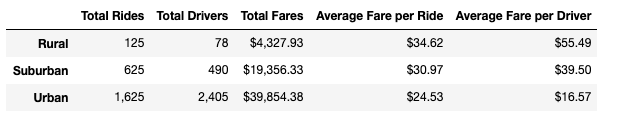
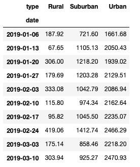
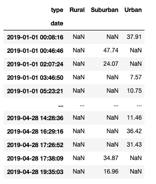

# PyBer_Analysis
Performing an analysis on ride-sharing data by city type. 

## Overview of Project 
### Purpose
In this new analysis, we compared the three city types(urban, suburban and rural) based on the total rides, total drivers and total fares in 2019. A more specified analysis was done on the total fares in each city type by date. Using Python plotting, a multi-line graph was created to show the total weekly fares for each city type between the months of January to April. This graph provides meaningful information that can be used to draw conclusions on city type trends, and weekly performance.

## Results 
1) A dataframe was created to compare the total rides, total drivers, total fares, average fare per ride and average fare per driver in each city type during the year of 2019 (shown below). The dataframe shows that the urban city type had the most total rides, total drivers and total revenue from fares in comparison to suburban and rural city types. The average fare per ride and average fare per driver were the lowest in the urban areas in comparison to the other two city types. Rural city type, on the other hand, had the lowest total rides, total drivers and total revenue from fares. The average fare per ride and average fare per driver was highest in rural city type in comparison to urban and suburban city types. The total rides in urban areas was 2.6 times greater than in suburban areas, and 13 times greater than in rural areas. From that, the total fares in urban areas was 2 times greater in comparison to total fares in suburban areas, and 9 times greater in comparison to rural areas.

2) A more specified analysis was conducted on the total weekly fares in the three city types between January and April. First, a dataframe was created to gather the total fare amount from each date in each city type, using the groupby() function. The dataframe was then converted to a pivot table, using the pivot() function, to show the total fare for the date and time of each ride in the city types. The loc function further narrowed the analysis to the rides between January 1st to April 29th (shown below). 

3) A new dataframe was created using the resample() function to gather the total weekly fares from January to April in each city type (shown below).

4)Using the new dataframe, a multi-line graph was created (shown below). The graph outlines the trend in total fares in each city type between the months of January and April. The peaks and dips in the line graphs indicate the total weekly fares. This graph provides meaningful information that can be used by PyBer in their business analysis. For example, in the 4 month span, the third week of February was the highest earning week in the urban and suburban city types. The highest earning week in the rural city type was the first week of April. As we know from the earlier dataframe, the urban city type accumulates the most total fares, and the rural city type accumulates the least. The total fares in rural areas ranged from $0 - $500, whereas the total fares in urban areas was between $1500 - $2500.

## Summary
As we know, rural areas have lower population density in comparison to urban and suburban areas. For this reason, the total amount of rides and drivers is much less in comparison to urban and suburban city type. Since there are less drivers and rides, each ride in a rural area is more expensive than in the other two city types. Furthermore, rides in rural areas are mostly likely longer since everything is spread out over a larger area. The average ride in a rural area is about $10 more than in an urban area, and about $4 more than in a suburban area. Since population is greater in urban areas, the demand for ride-sharing will also be greater. There is a constant need for ride-sharing in urban city types, which means we can slightly increase the fare prices in urban areas, while still maintaining similar demand. Increasing the fare prices in urban city type will reduce the disparities. Since trips in rural areas are probably longer and spread over a larger area, it will take drivers longer to reach pickup locations. If customers are left waiting a long time, they will most likely cancel the ride. If there are more drivers availble in various locations throughout the rural area, more rides can be completed, increasing total fares. In order to make solid conclusions about ride-sharing, we need to conduct further analysis. For example, gathering data and analyzing the times of day when there is the most activity and/or need for ride sharing. At those times the fares can be slightly lower, and the number of drivers can be greater. 
